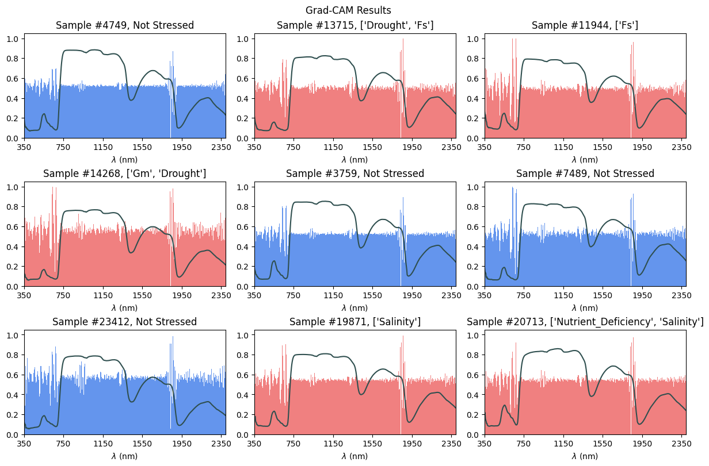
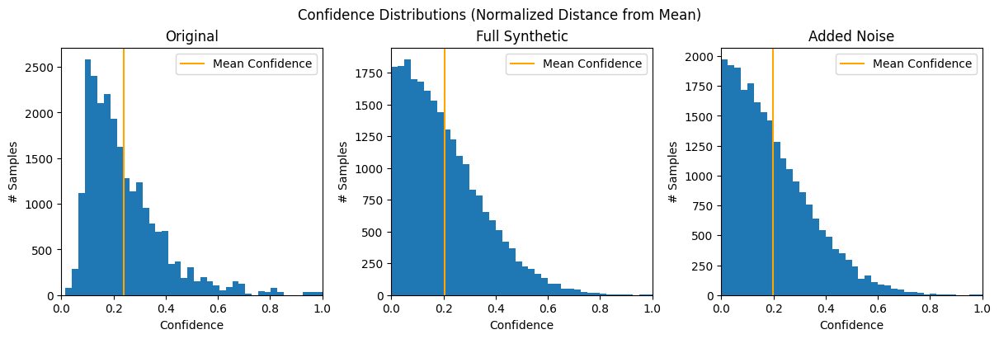

### 5/13/24
#### Grad-CAM

Got Grad-CAM working. Followed [this tutorial](https://keras.io/examples/vision/grad_cam/). Method originally described in [this paper](https://arxiv.org/abs/1610.02391).

Bars are Grad-CAM results, lines are the associated spectrographs. Generally, Grad-CAM tells how much the value at every wavelength impacts the final prediction. Mostly even across the spectrum except for two peaks around 600 nm and 1800 nm. 

Overall, doesn't reveal much. A similar approach to interpret a model for predicting individual stresses might be more useful, since such a model would be forced to be more "specific". 

These results do imply that no part of the spectrum is entirely irrelevant to whether or not the sample is stressed. 

#### Resampling Testing

Tested current CNN model using resampling method, where the data was repeatedly partitioned into training and validation sets, with the model being training on the training set and the accuracy being calculated on the validation set, for a total of 5 iterations. 

Mean accuracy was $0.9957$, with a standard deviation of $0.0013$.

### Confidence
The confidence of the CNN for a given prediction could roughly be calculated as the normalized distance of the prediction from the mean. 

Ideally, a high performing model like this would be highly confident on most samples, with a skewed-right distribution. Furthermore, confidence would significantly decrease when given garbage/noisy input data.

- Full Synthetic was calculated by taking the mean values at every wavelength and adding a random value between -3 and 3 standard distributions.
- Added Noise was calculated by taking each sample adding a random value between -3 and 3 standard distributions

Confidence here was skewed way left, and had a low overall average, despite the accuracy being ~99%. Furthermore, noisy and synthetic data yielded a similar confidence distribution, and only had slightly less confidence on average than the original data. 

Overall, this is a poor way of measuring confidence.