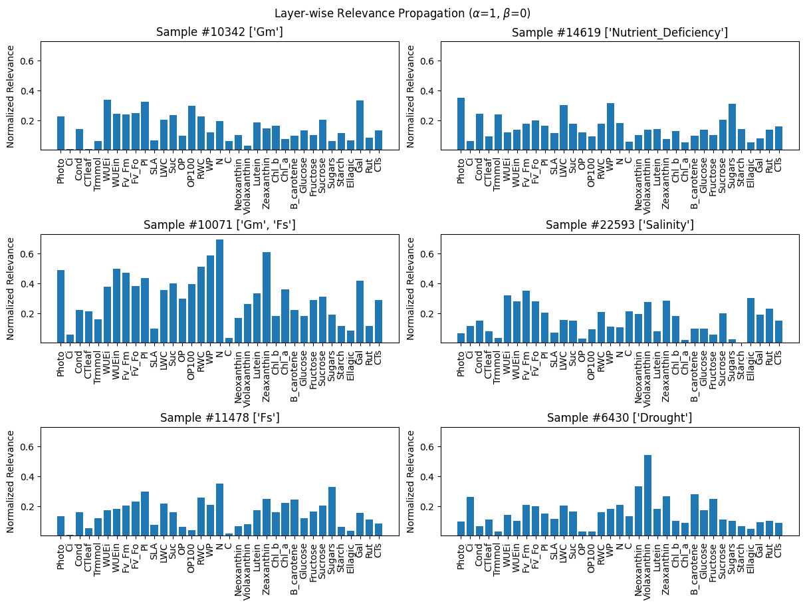
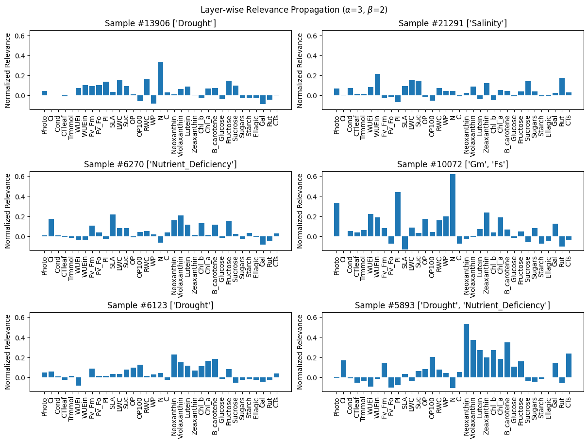
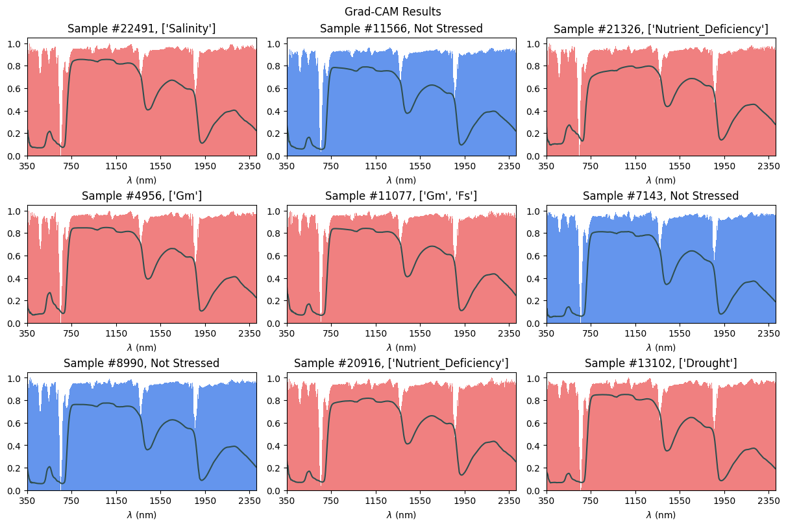
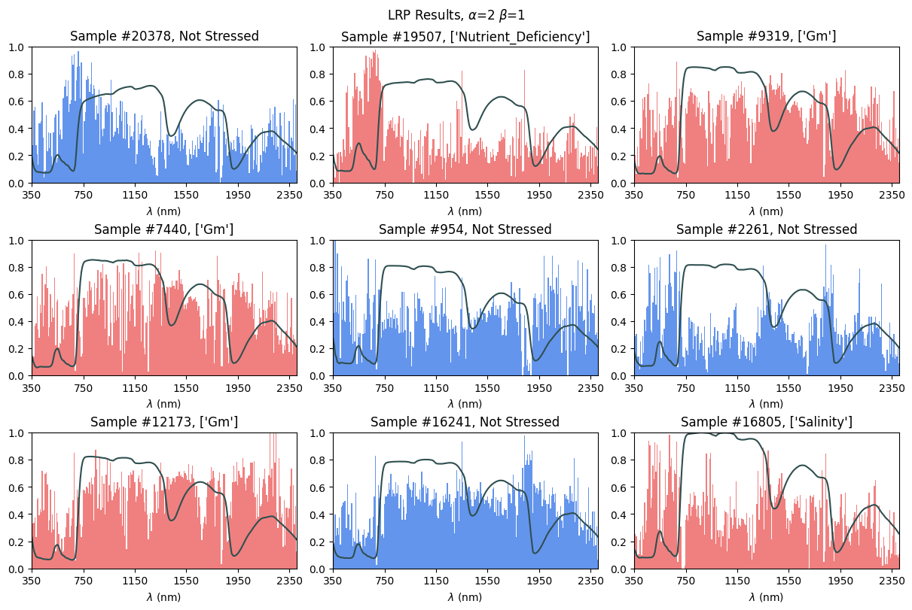

### 5/13/24
#### Grad-CAM

Got Grad-CAM working. Followed [this tutorial](https://keras.io/examples/vision/grad_cam/). Method originally described in [this paper](https://arxiv.org/abs/1610.02391).

Bars are Grad-CAM results, lines are the associated spectrographs. Generally, Grad-CAM tells how much the value at every wavelength impacts the final prediction. Mostly even across the spectrum except for two peaks around 600 nm and 1800 nm. 

Overall, doesn't reveal much. A similar approach to interpret a model for predicting individual stresses might be more useful, since such a model would be forced to be more "specific". 

These results do imply that no part of the spectrum is entirely irrelevant to whether or not the sample is stressed. 

#### Resampling Testing

Tested current CNN model using resampling method, where the data was repeatedly partitioned into training and validation sets, with the model being training on the training set and the accuracy being calculated on the validation set, for a total of 5 iterations. 

Mean accuracy was $0.9957$, with a standard deviation of $0.0013$.

### Confidence
The confidence of the CNN for a given prediction could roughly be calculated as the normalized distance of the prediction from the mean. 

Ideally, a high performing model like this would be highly confident on most samples, with a skewed-right distribution. Furthermore, confidence would significantly decrease when given garbage/noisy input data.

- Full Synthetic was calculated by taking the mean values at every wavelength and adding a random value between -3 and 3 standard distributions.
- Added Noise was calculated by taking each sample adding a random value between -3 and 3 standard distributions

Confidence here was skewed way left, and had a low overall average, despite the accuracy being ~99%. Furthermore, noisy and synthetic data yielded a similar confidence distribution, and only had slightly less confidence on average than the original data. 

Overall, this is a poor way of measuring confidence.

## 5/14/24
### Individual Stresses
Started trying to predict individual stresses. So far, using spectrographic data, similar to the model used for binary prediction, hasn't really worked. I am getting really good results using the calculated traits (100% validation accuracy).

### Interpretation
I tried a similar method to Grad-CAM to calculate the model's "sensitivity" to every trait. Based on [this paper](https://www.sciencedirect.com/science/article/pii/S1051200417302385).

$$
R_i = \frac{\partial f}{\partial x_i} \cdot x_i
$$

The sensitivities for every trait did not significantly differ accross the different stresses. I tried using dropout layers and regularization to try and force the model to pick only a few traits to consider, but it didn't really help. Overall, not very useful. Maybe a different way of calculating sensitivities would work better.

## 5/15/24
### Layer-wise Relevance Propagation
Tried a different method for explaining the neural network's predictions, following [the same paper from earlier](https://www.sciencedirect.com/science/article/pii/S1051200417302385#br0050), which discussed a method described in [this paper](https://journals.plos.org/plosone/article?id=10.1371/journal.pone.0130140#sec019). 

After a round of forward propagation, relevancy scores are calculated for each node going backwards through the layers. Relevancy of a the nodes in a layer is based on the contribution each node had on all of the nodes in the succeeding layer, scaled by the relevance of the nodes in that succeeding layer. The relevance of the output nodes are defined as their own activations. Scaling factors $\alpha$ and $\beta$ are applied to positive weights and negative weights respectively.

The way I have it implemented right now, it's stupidly slow (~60s for 1000 samples). Some clever vectorization would probably help. 

Much more interpretable results than with other methods. Might be worth using this method on the CNN for binary classification. 

These plots are on random stressed samples. More rigorous statistical analysis of this relevancy data across the whole dataset could be useful. 

## 5/20/24
### Spectral Model for Individual Stresses
Using only the first derivative and adding a bunch of dense layers made it work. Took way longer to train.

Accuracy at 99.89%.

### Grad-CAM, again
Grad-CAM on this model looks much different. 

No peaks, but a few big troughs, creating the appearance of 4 wide bands. I'm not sure what to make of it.

### LRP, again
The LRP results were very different from Grad-CAM.

Lots of variance between samples, can make out distinct peaks and troughs. Seems much more interpretable than Grad-CAM. Lots of noise, hard to tell if it's meaningful.

Due to Max-Pooling and Average-Pooling layers, the resolution is low (~8nm).

